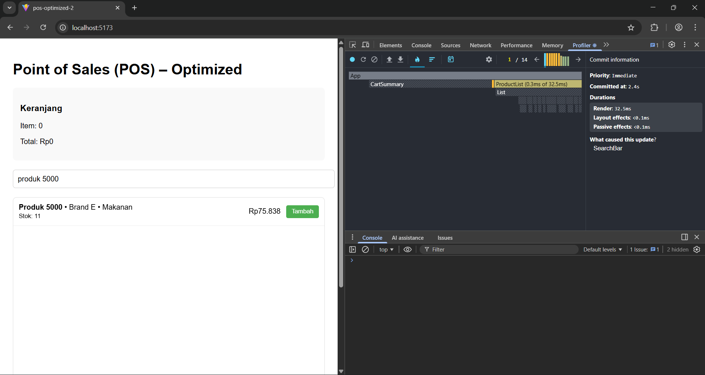
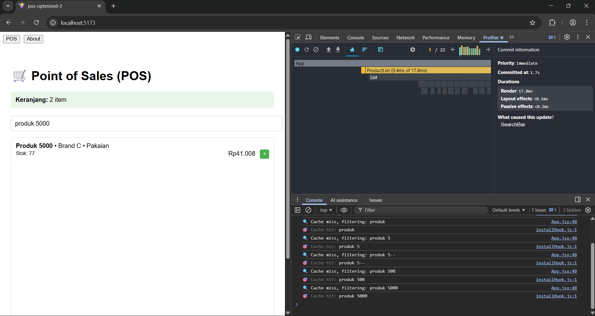
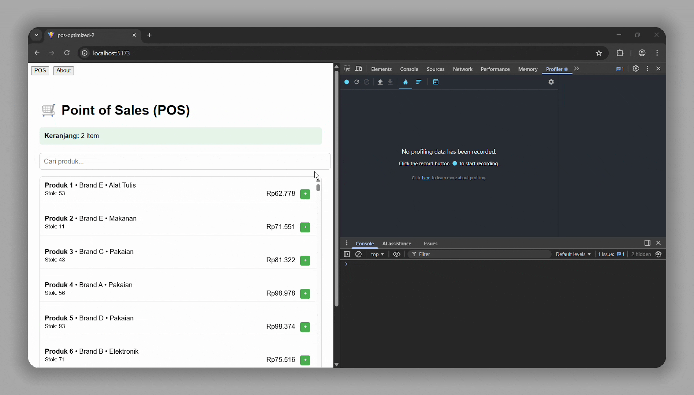

# Laporan Praktikum: Implementasi React Query

---

#### Nama: Surya Putra Pamungkas
#### NIM: V3424101
#### Mata Kuliah: Pemrograman Frontend

---

## 1. Perbandingan Waktu Respons

Sebelum menggunakan **React Query**, data diambil langsung melalui `fetch()` pada setiap render atau re-fetch manual. Setelah menggunakan React Query, data yang sudah pernah dimuat tersimpan di **cache** sehingga **permintaan ulang** untuk data yang sama menjadi jauh lebih cepat.

**Screenshot DevTools**
1. Sebelum React Query (Praktikum 1)

2. Sesudah React Query (Praktikum 2 & 3)


**Video DevTools**


## 2. Cara React Query Mengelola Cache Secara Otomatis

React Query secara otomatis:

* Menyimpan data hasil request ke dalam **cache in-memory**.
* Menentukan masa berlaku (TTL) data melalui properti `staleTime`.
* Jika data belum kadaluarsa, React Query akan **mengambil dari cache** tanpa memanggil API.
* Jika data sudah kadaluarsa atau pengguna berpindah tab, React Query dapat otomatis **re-fetch** untuk memperbarui data.
* Cache dihapus otomatis (garbage collected) setelah tidak digunakan selama `cacheTime` tertentu.

Contoh konfigurasi:

```js
const { data, isLoading } = useQuery({
  queryKey: ['users'],
  queryFn: fetchUsers,
  staleTime: 1000 * 60,   // 1 menit dianggap masih fresh
  cacheTime: 1000 * 300,  // disimpan di memori selama 5 menit
});
```

## 3. Keuntungan Menggunakan Library Daripada Custom Cache

| Aspek               | React Query                                                  | Custom Cache Manual               |
|---------------------|--------------------------------------------------------------|-----------------------------------|
| Manajemen cache     | Otomatis (dengan TTL, garbage collection, dll)               | Harus dibuat dan dikelola sendiri |
| Integrasi dengan UI | Terintegrasi dengan lifecycle React (refetch, loading state) | Perlu pengaturan manual           |
| Revalidate otomatis | Ya                                                           | Tidak, perlu logic tambahan       |
| DevTools            | Ada (mudah debugging)                                        | Tidak ada                         |
| Skalabilitas        | Siap untuk skala besar                                       | Rentan error dan sulit dirawat    |

**Kesimpulan:** Menggunakan library seperti React Query lebih efisien, stabil, dan mudah dikembangkan dibanding membuat sistem cache manual.

## 4. Apakah Menggunakan Cache atau LocalStorage Membuat Aplikasi Lebih Baik?

Ya, **menggunakan cache** membuat aplikasi lebih baik, **asalkan digunakan dengan baik dan benar**.

**Alasan:**

* **Waktu respons lebih cepat** karena data tidak selalu diambil dari server.
* **Mengurangi beban server** dengan memanfaatkan data lokal.
* **Meningkatkan pengalaman pengguna (UX)** karena tampilan tidak kosong saat loading.

Namun, **localStorage** cocok untuk data persisten (disimpan setelah reload), sedangkan **React Query cache** ideal untuk data yang sering berubah tetapi masih relevan dalam waktu singkat.
Menggabungkan keduanya (misalnya React Query + persist plugin) bisa memberikan hasil optimal.

---